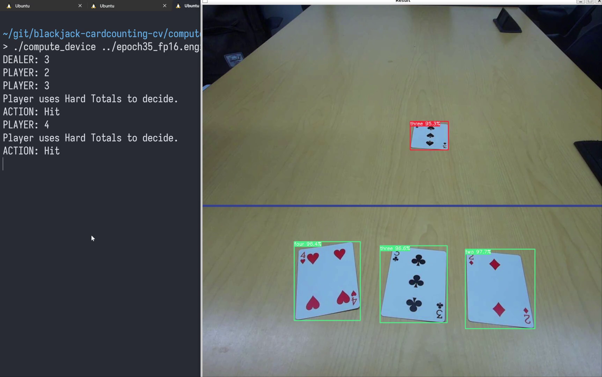

# Compute Device

This is the brain of the card counting device and is intended to run remotely on an CUDA-enabled Linux device.

## Installation

### Prerequisites
- Compiler that supports C++17
- CMake >= 3.19
- Python >= 3.10
- CUDA >= 11.4
- TensorRT >= 8.4
- OpenCV >= 4.7 with GTK support

#### OpenCV
If your system's OpenCV installation does not support GTK (required for viewing camera footage), you must compile from source. Refer to the [official documentation](https://docs.opencv.org/4.x/d2/de6/tutorial_py_setup_in_ubuntu.html) for installation.

#### TensorRT

Refer to [Nvidia's official documentation](https://docs.nvidia.com/deeplearning/tensorrt/install-guide/index.html#installing) for downloading and installing the CUDA toolchain and TensorRT library. The TAR file method is strongly recommended for your TensorRT installation.

### Building

Run the following commands while in the `compute_device` directory. Note that you will need to change the `TENSOR_HOME` environment variable to the absolute path to your TensorRT installation.
```
mkdir build && cd build
TENSOR_HOME=/path/to/TensorRT-8.6.1.6 cmake ..
make
```
This will produce an executable named `compute_device` in the `build` directory.

### PyTorch Model Conversion
To use TensorRT, PyTorch models (stored with a `.pt` extension) must be converted into the TensorRT engine format (`.engine`). Scripts for automating this conversion are available in the `engine` directory. To convert a model, run the following commands. Note that you will need to change the argument to `./convert.sh` to your model's path.

```
cd engine
pip3 install -r requirements.txt
./convert.sh /path/to/model.pt
```
After the conversion process is finished, the engine file will be written to the model path (but with the `.engine` extension). Note that creating the engine ties it to the system used to create it for performance reasons, so ensure that these steps are conducted on the system intended to run the `compute_device` executable.

## Usage

You must spin up the servers in the `pi` directory _before_ running the `compute_device` executable since it will establish TCP connections on startup. Refer to its user documentation for details. 

There are 4 required arguments. In order, they are:

1. The path to the engine created from converting your model.
2. The URL to the video feed.
3. The IPv4 address of the Pi.
4. The TCP port of the GPIO server.

Here's an example using engine file `epoch35_fp16.engine` and IPv4 address `10.228.58.178`:

```
./compute_device ../epoch35_fp16.engine http://10.228.58.178:8000/stream.mjpg 10.228.58.178 8889
```

The program will print out the perceived cards and the actions that the player should take. In addition, a window of the camera's view should be displayed. The dealer's cards will be boxed in red, and the player's cards will be boxed in green. The horizontal blue line delimits the boundary between the dealer's and player's cards. Here's an example:


